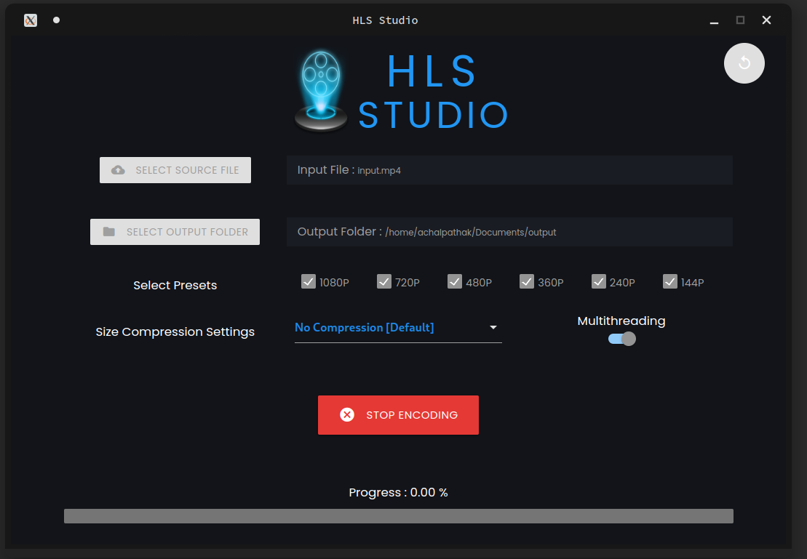

# HLS Studio

HLS Studio is a powerful video processing tool built using Electron.js. It allows you to easily convert videos into HLS (HTTP Live Streaming) playlists with a range of presets, from high-quality 1080p down to bandwidth-efficient 144p. HLS Studio also features multithreading capabilities for faster processing.

## ✨ Features

- Convert videos to HLS playlists with ease.
- Multiple preset options for different video qualities.
- Multithreading support for faster processing.
- Intuitive user interface for a smooth user experience.

## 🚀 Screenshots

<!-- Add screenshots of your application in action here -->

## 🛠️ Tech Stack

**Client:** ElectronJS, Materialize CSS

**Backend:** NodeJS, FFMPEG
